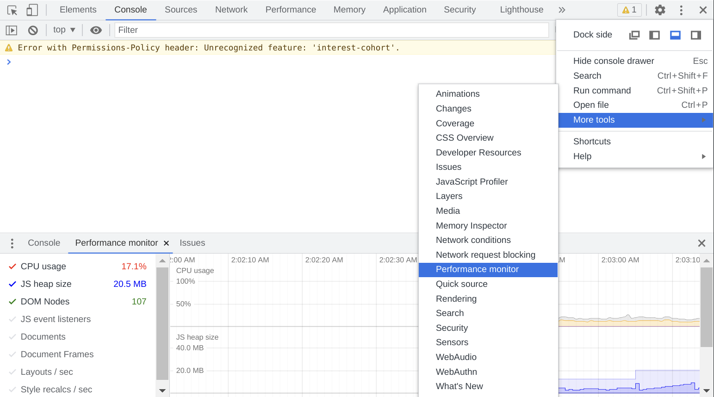
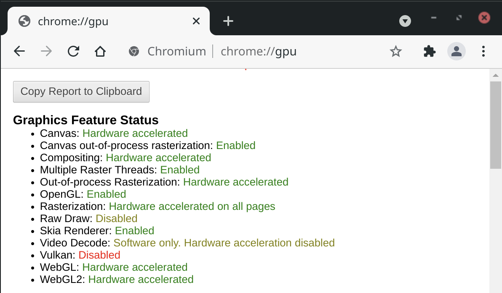
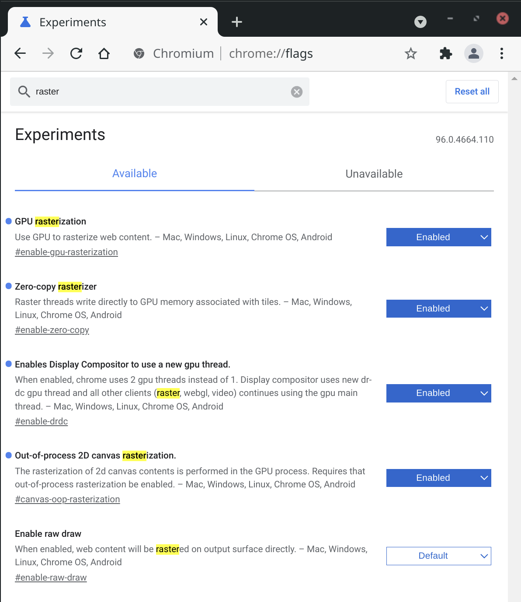

## 📈 μPlot

A small ([~45 KB min](https://github.com/leeoniya/uPlot/tree/master/dist/uPlot.iife.min.js)), [fast](#performance) chart for time series, lines, areas, ohlc & bars _(MIT Licensed)_

---
### Introduction

μPlot is a [fast, memory-efficient](#performance) [Canvas 2D](https://developer.mozilla.org/en-US/docs/Web/API/CanvasRenderingContext2D)-based chart for plotting [time series](https://en.wikipedia.org/wiki/Time_series), lines, areas, ohlc & bars; from a cold start it can create an interactive chart containing 150,000 data points in 90ms, scaling linearly at [~31,000 pts/ms](https://leeoniya.github.io/uPlot/bench/uPlot-10M.html). In addition to fast initial render, the zooming and cursor performance is by far the best of any similar charting lib; at ~50 KB, it's likely the smallest and fastest time series plotter that doesn't make use of [context-limited](https://bugs.chromium.org/p/chromium/issues/detail?id=771792) WebGL shaders or WASM, both of which have much higher startup cost and code size.

<h3 align="center">166,650 point bench: <a href="https://leeoniya.github.io/uPlot/bench/uPlot.html">https://leeoniya.github.io/uPlot/bench/uPlot.html</a></h3>

However, if you need 60fps performance with massive streaming datasets, uPlot [can only get you so far](https://huww98.github.io/TimeChart/docs/performance).
If you decide to venture into this realm with uPlot, make sure to [unclog your rendering pipeline](#unclog-your-rendering-pipeline).
WebGL should still be the tool of choice for applications like realtime signal or waveform visualizations:
See [danchitnis/webgl-plot](https://github.com/danchitnis/webgl-plot), [huww98/TimeChart](https://github.com/huww98/TimeChart), [epezent/implot](https://github.com/epezent/implot), or commercial products like [LightningChart®](https://www.arction.com/lightningchart-js/).

---

---
### Features

- Multiple series w/toggle
- Multiple y-axes, scales & grids
- Temporal or numeric x-axis
- Linear, uniform or [logarithmic](https://leeoniya.github.io/uPlot/demos/log-scales.html) scales
- Line & Area styles (stroke, fill, width, dash)
- Pluggable path renderers [linear, spline, stepped, bars](https://leeoniya.github.io/uPlot/demos/line-paths.html)
- Zoom with auto-rescale
- Legend with live values
- Support for [IANA Time Zone Names](https://en.wikipedia.org/wiki/List_of_tz_database_time_zones) & DST
- [Support for missing data](https://leeoniya.github.io/uPlot/demos/missing-data.html)
- [Cursor sync for multiple charts](https://leeoniya.github.io/uPlot/demos/sync-cursor.html)
- [Focus closest series](https://leeoniya.github.io/uPlot/demos/focus-cursor.html)
- [Data streaming (live update)](https://leeoniya.github.io/uPlot/demos/stream-data.html)
- [High / Low bands](https://leeoniya.github.io/uPlot/demos/high-low-bands.html)
- A lean, consistent, and powerful API with hooks & plugins

---
### Non-Features

In order to stay lean, fast and focused the following features will not be added:

- No data parsing, aggregation, summation or statistical processing - just do it in advance. e.g. https://simplestatistics.org/, https://github.com/leeoniya/uDSV
- No transitions or animations - they're always pure distractions.
- No collision avoidance for axis tick labels, so may require manual tweaking of spacing metrics if label customization significiantly increases default label widths.
- No stacked series: see ["Stacked Area Graphs Are Not Your Friend"](https://web.archive.org/web/20221208193656/https://everydayanalytics.ca/2014/08/stacked-area-graphs-are-not-your-friend.html) and a [horrific demo](https://leeoniya.github.io/uPlot/demos/stacked-series.html). While smooth spline interpolation is available, its use is strongly discouraged: [Your data is misrepresented!](http://www.vizwiz.com/2011/12/when-you-use-smoothed-line-chart-your.html). Both visualizations are terrible at accurately communicating information.
- No built-in drag scrolling/panning due to ambiguous native zoom/selection behavior. However, this can be added externally via the plugin/hooks API: [zoom-wheel](https://leeoniya.github.io/uPlot/demos/zoom-wheel.html), [zoom-touch](https://leeoniya.github.io/uPlot/demos/zoom-touch.html).

---
### Documentation (WIP)

The docs are a perpetual work in progress, it seems.
Start with [/docs/README.md](https://github.com/leeoniya/uPlot/tree/master/docs) for a conceptual overview.
The full API is further documented via comments in [/dist/uPlot.d.ts](https://github.com/leeoniya/uPlot/blob/master/dist/uPlot.d.ts).
Additionally, an ever-expanding collection of runnable [/demos](https://leeoniya.github.io/uPlot/demos/index.html) covers the vast majority of uPlot's API.

---
### Third-party Integrations

- [Jupyter widget](https://github.com/sohailsomani/uplot_jupyter_widget) (Sohail Somani)
- [React and Vue.js](https://github.com/skalinichev/uplot-wrappers) (Sergey Kalinichev)

---
### Performance

Benchmarks done on this hardware:

- Date: 2023-03-11
- AMD Ryzen 7 PRO 5850U @ 1.9GHz, 32GB RAM
- EndeavourOS/Arch (KDE/Plasma), Chrome 113.0.5638.0 (64-bit)
- 4K display scaled to 1440p (1.5 devicePixelRatio)

Full size: https://leeoniya.github.io/uPlot/demos/multi-bars.html

Raw data: https://github.com/leeoniya/uPlot/blob/master/bench/results.json

<pre>
| lib                    | size    | done    | js,rend,paint,sys | heap peak,final | mousemove (10s)     |
| ---------------------- | ------- | ------- | ----------------- | --------------- | ------------------- |
| <a href="https://leeoniya.github.io/uPlot/bench/uPlot.html">uPlot v1.6.24</a>          | 47.9 KB |   34 ms |   51   2   1   34 |  21 MB   3 MB   |  218  360  146  196 |
| <a href="https://leeoniya.github.io/uPlot/bench/Chart.js4.html">Chart.js v4.2.1</a>        |  254 KB |   38 ms |   90   2   1   40 |  29 MB  10 MB   | 1154   46  165  235 |
| <a href="https://leeoniya.github.io/uPlot/bench/Flot.html">Flot v3.0.0</a>            |  494 KB |   60 ms |  105   5   1   52 |  41 MB  21 MB   | ---                 |
| <a href="https://leeoniya.github.io/uPlot/bench/ECharts5.html">ECharts v5.4.1</a>         | 1000 KB |   55 ms |  148   3   1   35 |  17 MB   3 MB   | 1943  444  203  208 |
| <a href="https://leeoniya.github.io/uPlot/bench/dygraphs.html">dygraphs v2.2.1</a>        |  132 KB |   90 ms |  163   2   1   33 |  88 MB  42 MB   | 1438  371  174  268 |
| <a href="https://leeoniya.github.io/uPlot/bench/LightningChart.html">LightningChart® v4.0.2</a> | 1300 KB |  --- ms |  250   2   1   33 |  33 MB  13 MB   | 5390  120  128  325 |
| <a href="https://leeoniya.github.io/uPlot/bench/CanvasJS.html">CanvasJS v3.7.5</a>        |  489 KB |  130 ms |  266   4   1   35 |  98 MB  69 MB   | 1030  445   90  246 |
| <a href="https://leeoniya.github.io/uPlot/bench/dvxCharts.html">dvxCharts v5.1.0</a>       |  373 KB |  160 ms |  264  23   1   62 | 100 MB  61 MB   |  687  779  206  197 |
| <a href="https://leeoniya.github.io/uPlot/bench/Highcharts.html">Highcharts v10.3.3</a>     |  413 KB |  --- ms |  416   7   1   38 |  97 MB  55 MB   | 1286  824  205  242 |
| <a href="https://leeoniya.github.io/uPlot/bench/Plotly.js.html">Plotly.js v2.18.2</a>      | 3600 KB |  310 ms |  655  14   1   40 | 104 MB  70 MB   | 1814  163   25  208 |
| <a href="https://leeoniya.github.io/uPlot/bench/ApexCharts.html">ApexCharts v3.37.1</a>     |  503 KB |  685 ms |  694   9   1   33 | 175 MB  46 MB   | 1708  421  106  207 |
| <a href="https://leeoniya.github.io/uPlot/bench/ZingChart.html">ZingChart v2.9.10</a>      |  871 KB |  681 ms |  717   7   1  105 | 290 MB 195 MB   | 9021  305   41   71 |
| <a href="https://leeoniya.github.io/uPlot/bench/amCharts5.html">amCharts v5.3.7</a>        |  625 KB |  --- ms | 1601   3   3   46 | 147 MB 121 MB   | 9171   71  460  167 |
</pre>

- libs are sorted by their initial, cold-start, render performance (excluding network transfer time to download the lib)
- `size` includes the lib itself plus any dependencies required to render the benchmark, e.g. Moment, jQuery, etc.
- Flot does not make available any minified assets and all their examples use the uncompressed sources; they also use an uncompressed version of jQuery :/

Some libraries provide their own performance demos:

- https://echarts.apache.org/next/examples/en/index.html
- https://github.com/sveinn-steinarsson/flot-downsample/
- https://dygraphs.com/tests/dygraph-many-points-benchmark.html
- https://www.chartjs.org/docs/latest/general/performance.html
- https://dash.plotly.com/performance
- https://www.highcharts.com/docs/advanced-chart-features/boost-module
- https://danchitnis.github.io/webgl-plot-examples/vanilla/
- https://huww98.github.io/TimeChart/docs/performance
- https://www.arction.com/lightningchart-js-performance/

TODO (all of these use SVG, so performance should be similar to Highcharts):

- Chartist.js
- d3-based
  - C3.js
  - dc.js
  - MetricsGraphics
  - rickshaw

---
### Unclog your rendering pipeline

Your browser's performance is highly dependent on your hardware, operating system, and GPU drivers.

If you're using a Chromium-based browser, there are some hidden settings that can unlock significant performance improvements for Canvas2D rendering.
Most of these have to do with where and how the rasterization is performed.

Head over to https://leeoniya.github.io/uPlot/demos/sine-stream.html and open up Chrome's DevTools (F12), then toggle the Performance Monitor.

For me:

- On Windows 10 Desktop, Core i7-8700, 16GB RAM, AMD RX480 GPU, 2048 x 1080 resolution = 57% CPU usage
- On Manjaro Laptop (Arch Linux), AMD Ryzen 7 PRO 5850U, 48GB RAM, AMD Radeon RX Vega 8 (integrated GPU), 4K resolution = **99% CPU usage**

If your CPU is close to 100%, it may be rasterizing everything in the same CPU process.

Pop open `chrome://gpu` and see what's orange or red.

Then open `chrome://flags` and search for "raster" to see what can be force-enabled.

- On my Manjaro/Ryzen/Integrated GPU setup, force-enabling `Canvas out-of-process rasterization` resulted in a dramatic framerate improvement.
- On my Windows/i7/Dedicated GPU setup, toggling the same flags moved the work to another process (still good), but did not have a significant framerate impact.

YMMV!

---
### Acknowledgements

- Dan Vanderkam's [dygraphs](https://github.com/danvk/dygraphs) was a big inspiration; in fact, my stale [pull request #948](https://github.com/danvk/dygraphs/pull/948) was a primary motivator for μPlot's inception.
- Adam Pearce for [#15 - remove redundant lineTo commands](https://github.com/leeoniya/uPlot/issues/15).
