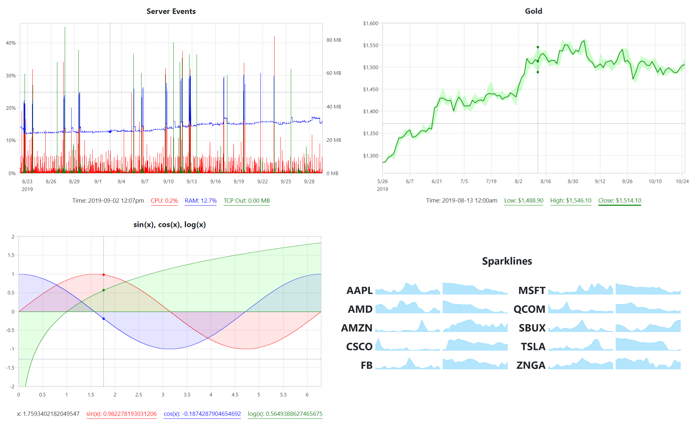
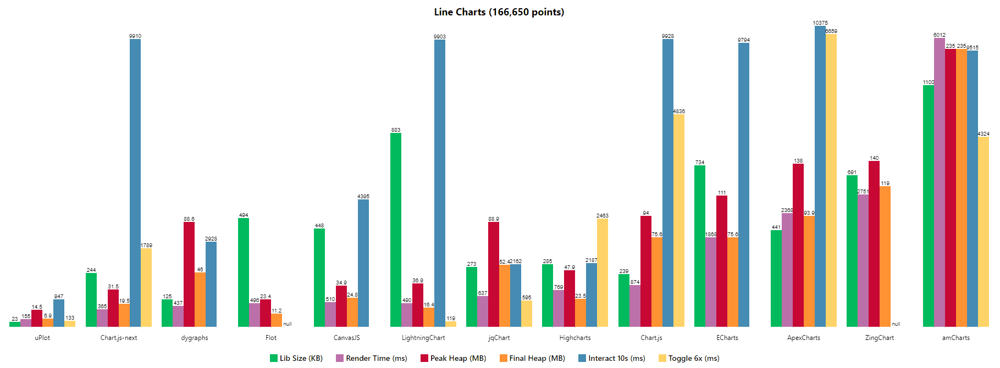

## 📈 μPlot

A small ([~35 KB min](https://github.com/leeoniya/uPlot/tree/master/dist/uPlot.iife.min.js)), [fast](#performance) chart for time series, lines, areas, ohlc & bars _(MIT Licensed)_

---
### Introduction

μPlot is a [fast, memory-efficient](#performance) [Canvas 2D](https://developer.mozilla.org/en-US/docs/Web/API/CanvasRenderingContext2D)-based chart for plotting [time series](https://en.wikipedia.org/wiki/Time_series), lines, areas, ohlc & bars; from a cold start it can create an interactive chart containing 150,000 data points in 135ms, scaling linearly at [~25,000 pts/ms](https://leeoniya.github.io/uPlot/bench/uPlot-10M.html). In addition to fast initial render, the zooming and cursor performance is by far the best of any similar charting lib; at ~35 KB, it's likely the smallest and fastest time series plotter that doesn't make use of [context-limited](https://bugs.chromium.org/p/chromium/issues/detail?id=771792) WebGL shaders or WASM, both of which have much higher startup cost and code size.

<h3 align="center">166,650 point bench: <a href="https://leeoniya.github.io/uPlot/bench/uPlot.html">https://leeoniya.github.io/uPlot/bench/uPlot.html</a></h3>

However, if you need 60fps performance with massive streaming datasets, uPlot [can only get you so far](https://huww98.github.io/TimeChart/docs/performance).
WebGL should still be the tool of choice for applications like realtime signal or waveform visualizations:
See [danchitnis/webgl-plot](https://github.com/danchitnis/webgl-plot), [huww98/TimeChart](https://github.com/huww98/TimeChart), [epezent/implot](https://github.com/epezent/implot), or commercial products like [LightningChart®](https://www.arction.com/lightningchart-js/).

---

---
### Features

- Multiple series w/toggle
- Multiple y-axes, scales & grids
- Temporal or numeric x-axis
- Linear, uniform or [logarithmic](https://leeoniya.github.io/uPlot/demos/log-scales.html) scales
- Line & Area styles (stroke, fill, width, dash)
- Pluggable path renderers [linear, spline, stepped, bars](https://leeoniya.github.io/uPlot/demos/line-paths.html)
- Zoom with auto-rescale
- Legend with live values
- Support for [IANA Time Zone Names](https://en.wikipedia.org/wiki/List_of_tz_database_time_zones) & DST
- [Support for missing data](https://leeoniya.github.io/uPlot/demos/missing-data.html)
- [Cursor sync for multiple charts](https://leeoniya.github.io/uPlot/demos/sync-cursor.html)
- [Focus closest series](https://leeoniya.github.io/uPlot/demos/focus-cursor.html)
- [Data streaming (live update)](https://leeoniya.github.io/uPlot/demos/stream-data.html)
- [High / Low bands](https://leeoniya.github.io/uPlot/demos/high-low-bands.html)
- A lean, consistent, and powerful API with hooks & plugins

---
### Non-Features

In order to stay lean, fast and focused the following features will not be added:

- No data parsing, aggregation, summation or statistical processing - just do it in advance. e.g. https://simplestatistics.org/, https://www.papaparse.com/
- No transitions or animations - they're always pure distractions.
- No collision avoidance for axis tick labels, so may require manual tweaking of spacing metrics if label customization significiantly increases default label widths.
- No stacked series: see ["Stacked Area Graphs Are Not Your Friend"](https://everydayanalytics.ca/2014/08/stacked-area-graphs-are-not-your-friend.html) and a [horrific demo](https://leeoniya.github.io/uPlot/demos/stacked-series.html). While smooth spline interpolation is available, its use is strongly discouraged: [Your data is misrepresented!](http://www.vizwiz.com/2011/12/when-you-use-smoothed-line-chart-your.html). Both visualizations are terrible at accurately communicating information.
- No built-in drag scrolling/panning due to ambiguous native zoom/selection behavior. However, this can be added externally via the plugin/hooks API: [zoom-wheel](https://leeoniya.github.io/uPlot/demos/zoom-wheel.html), [zoom-touch](https://leeoniya.github.io/uPlot/demos/zoom-touch.html).

---
### Documentation (WIP)

The docs are a perpetual work in progress, it seems.
Start with [/docs/README.md](https://github.com/leeoniya/uPlot/tree/master/docs) for a conceptual overview.
The full API is further documented via comments in [/dist/uPlot.d.ts](https://github.com/leeoniya/uPlot/blob/master/dist/uPlot.d.ts).
Additionally, an ever-expanding collection of runnable [/demos](https://leeoniya.github.io/uPlot/demos/index.html) covers the vast majority of uPlot's API.

---
### Third-party Integrations

- [Jupyter widget](https://github.com/sohailsomani/uplot_jupyter_widget) (Sohail Somani)
- [React and Vue.js](https://github.com/skalinichev/uplot-wrappers) (Sergey Kalinichev)

---
### Performance

Benchmarks done on this hardware:

- Date: 2021-04-24
- Windows 10 x64, Chrome 90.0.4430.85 (64-bit)
- Core i7-8700 @ 3.2GHz, 16GB RAM
- AMD Radeon RX480, 2560x1440 res

Full size: https://leeoniya.github.io/uPlot/demos/multi-bars.html

Raw data: https://github.com/leeoniya/uPlot/blob/master/bench/results.json

<pre>
| lib                    | size    | done    | js,rend,paint,sys | heap peak,final | mousemove (10s)     |
| ---------------------- | ------- | ------- | ----------------- | --------------- | ------------------- |
| <a href="https://leeoniya.github.io/uPlot/bench/uPlot.html">uPlot v1.6.9</a>           |   39 KB |   58 ms |   70   1   1   38 |  20 MB   3 MB   |   65  159   88  103 |
| <a href="https://leeoniya.github.io/uPlot/bench/ECharts5.html">ECharts v5.1.0</a>         |  987 KB |   88 ms |   87   1   1   47 |  55 MB   5 MB   | 1463  284   84  521 |
| <a href="https://leeoniya.github.io/uPlot/bench/Chart.js3.html">Chart.js v3.2.0</a>        |  233 KB |   80 ms |  118   1   1   41 |  34 MB  11 MB   |  725   30   57 1467 |
| <a href="https://leeoniya.github.io/uPlot/bench/Flot.html">Flot v3.0.0</a>            |  494 KB |   91 ms |  118   3   1   55 |  46 MB  16 MB   | ---                 |
| <a href="https://leeoniya.github.io/uPlot/bench/LightningChart.html">LightningChart® v2.2.1</a> | 1000 KB |  --- ms |  178   2   1   42 |  61 MB  22 MB   | 5310   46   43  180 |
| <a href="https://leeoniya.github.io/uPlot/bench/dygraphs.html">dygraphs v2.1.0</a>        |  125 KB |  135 ms |  159   2   1   75 |  99 MB  44 MB   | 1087  162   74  205 |
| <a href="https://leeoniya.github.io/uPlot/bench/CanvasJS.html">CanvasJS v3.2.13</a>       |  482 KB |  241 ms |  271   2   1   66 |  52 MB  26 MB   |  961  256   76  195 |
| <a href="https://leeoniya.github.io/uPlot/bench/Highcharts.html">Highcharts v9.0.1</a>      |  391 KB |  --- ms |  286   4   2   42 | 108 MB  33 MB   |  840  301  132  155 |
| <a href="https://leeoniya.github.io/uPlot/bench/dvxCharts.html">dvxCharts v5.0.0</a>       |  369 KB |  253 ms |  310  18   1   51 |  60 MB  24 MB   |  674  442  148  145 |
| <a href="https://leeoniya.github.io/uPlot/bench/Plotly.js.html">Plotly.js v1.58.4</a>      | 3500 KB |  377 ms |  408   5   1   71 | 199 MB  46 MB   | 1087  114   29   82 |
| <a href="https://leeoniya.github.io/uPlot/bench/Chart.js2.html">Chart.js v2.9.4</a>        |  245 KB |  495 ms |  524   2   1   75 | 103 MB  54 MB   | 8397    5    6 1158 |
| <a href="https://leeoniya.github.io/uPlot/bench/ECharts4.html">ECharts v4.9.0</a>         |  785 KB |  366 ms |  498   1   1  581 | 224 MB  78 MB   | 2265   64   17 7551 |
| <a href="https://leeoniya.github.io/uPlot/bench/ApexCharts.html">ApexCharts v3.26.1</a>     |  478 KB |  --- ms | 1634  22   1   44 | 332 MB  70 MB   | 8611  646   99  154 |
| <a href="https://leeoniya.github.io/uPlot/bench/ZingChart.html">ZingChart v2.9.3</a>       |  857 KB | 2081 ms | 2101   5   1   38 | 191 MB 100 MB   | ---                 |
| <a href="https://leeoniya.github.io/uPlot/bench/amCharts.html">amCharts v4.10.18</a>      | 1200 KB | 5564 ms | 4925  19   6   67 | 695 MB 237 MB   | 1494  336  164  285 |
</pre>

Normally, all libs are updated to their latest versions before each benchmark round. However, libraries which show significant performance improvements in latest versions will have prior versions shown to encourage migration; this is especially true for still-widely-deployed libs, such as Chart.js v2.9.4, and ECharts v4.9.0. Deployment prevalence is assessed from public npm and CDN download stats for the prior few months.

- libs are sorted by their initial, cold-start, render performance (excluding network transfer time to download the lib)
- `size` includes the lib itself plus any dependencies required to render the benchmark, e.g. Moment, jQuery, etc.
- Flot does not make available any minified assets and all their examples use the uncompressed sources; they also use an uncompressed version of jQuery :/

Some libraries provide their own performance demos:

- https://echarts.apache.org/next/examples/en/index.html
- https://github.com/sveinn-steinarsson/flot-downsample/
- https://dygraphs.com/tests/dygraph-many-points-benchmark.html
- https://www.chartjs.org/docs/latest/general/performance.html
- https://dash.plotly.com/performance
- https://www.highcharts.com/docs/advanced-chart-features/boost-module
- https://danchitnis.github.io/webgl-plot-examples/vanilla/
- https://huww98.github.io/TimeChart/docs/performance
- https://www.arction.com/lightningchart-js-performance/

TODO (all of these use SVG, so performance should be similar to Highcharts):

- Chartist.js
- d3-based
  - C3.js
  - dc.js
  - MetricsGraphics
  - rickshaw

---
### Acknowledgements

- Dan Vanderkam's [dygraphs](https://github.com/danvk/dygraphs) was a big inspiration; in fact, my stale [pull request #948](https://github.com/danvk/dygraphs/pull/948) was a primary motivator for μPlot's inception.
- Adam Pearce for [#15 - remove redundant lineTo commands](https://github.com/leeoniya/uPlot/issues/15).
